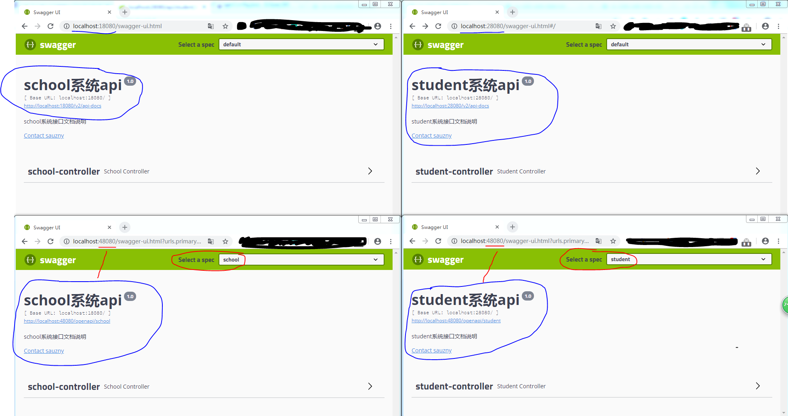

# jkitchen_note_swagger2

swagger2的使用

效果图：

工程说明：

- sb-api-gateway：spring cloud gateway集成swagger2统一查看apidoc
- sb-school-server：school demo server
- sb-student-server：student demo server
- sb-swagger-gateway：开始的时候使用sc-gateway集成失败了，自己编写的，现在废弃

